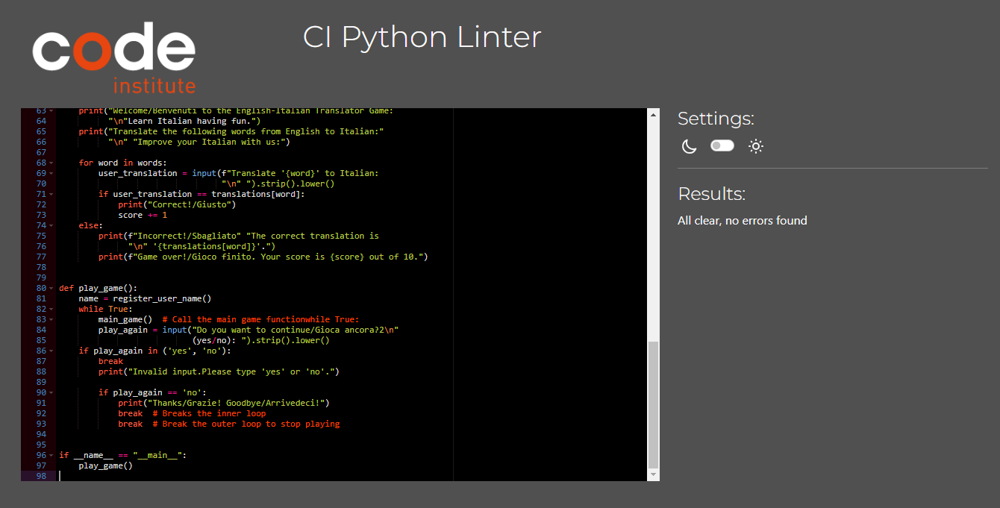

# Game name:
English to Italian game translater.

# Initial Discussion:
The game is created to help italian lover users to improve their italian while having fun at the same time.

# Key Information for the site:
Any user of any age can access the game with only name  registration.
User get scores completting the game.

# Functions:
Analyse the user correct answer.
Give scores according to right answers.
Give correct answer incase of wrong answer.

# User Stories
Client goals:
A simple stranslator that anyone can use.
The program has no limitation of age 
Only name registration needed.

# Returning vistor goals:
A pleasant user experience.
English and Italian improvement.

# Design:
I used the run.py to creat a simple game that is clear and clean and easy to understand for all type of age.

# Existing Features:
There is instructions explaining user to type the existing english words in italian
The feedback of correct answer if the user gets the answer wrong.
User gets back the scores after 10 question trials.
User is asked if they wish to continue palying or exit the game.

# main Menu:
The main menu gives users options;
Enter their name
Enter their answer
respond correct or wrong
give right answer if wrong
give scores
options to quit or go forward palying.

# Used Technology:
The game/program was written using Python.

Frameworks:
Codespace - To write the code using python libraries 
Github - To save and store files
Heroku - To deploy and run the project
Readme - to give Excelent format to produce this table.

# validated on CI pythone linter

# credits
tuttor Marko
Mentor Sheryl 

